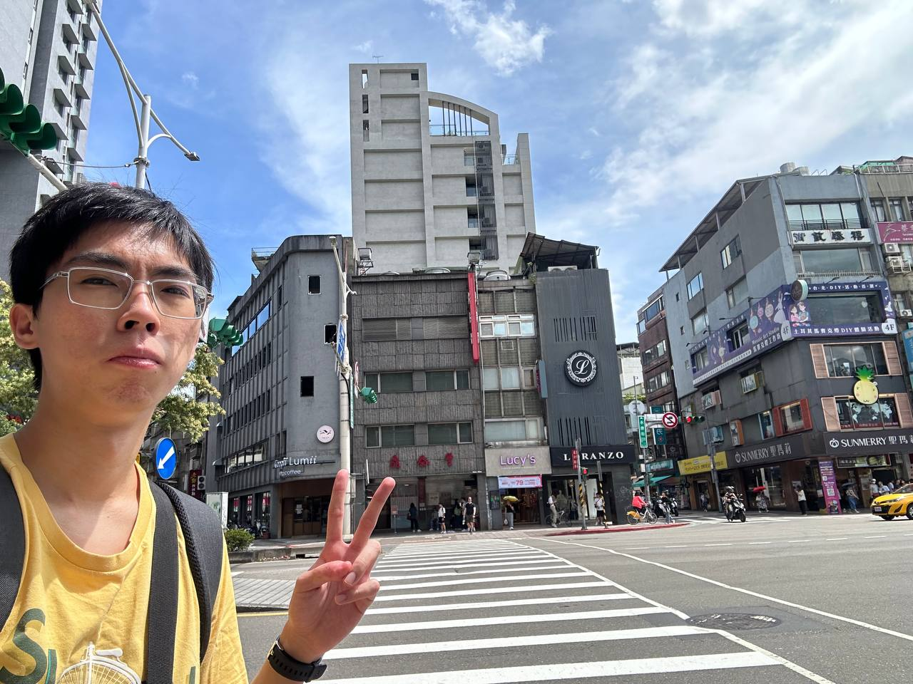
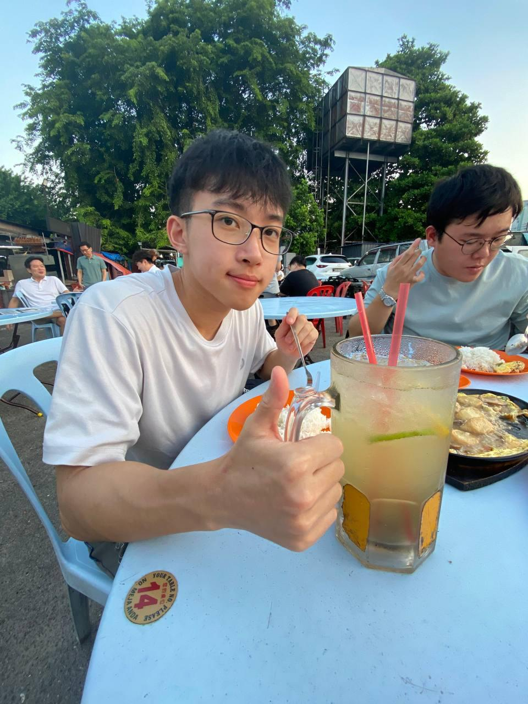
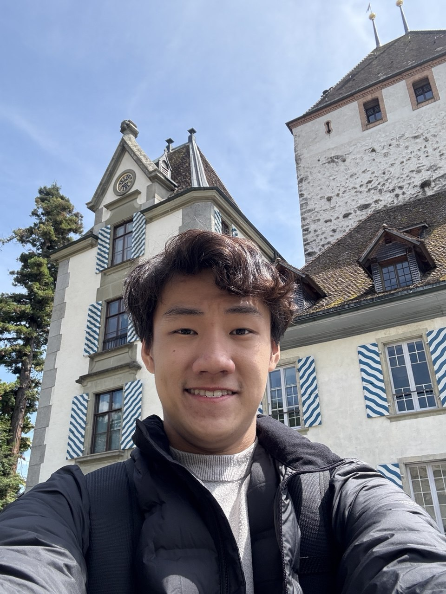

# About Us

We are a team based in the [School of Computing, National University of Singapore](http://www.comp.nus.edu.sg).

You can reach us at the email `e1334289@u.nus.edu`

## Project team

### Jiang Zichen

[[github](https://github.com/hui-x1ng)]
[[portfolio](https://www.linkedin.com/in/zichen-jiang-666356322/)]

* Role: Developer
* Responsibilities: UI, Peer Support, Testing

### Jane Doe

[[github](https://github.com/Miloepeng?tab=repositories)]
[[portfolio](https://www.linkedin.com/in/yong-sheng-yeo-158b2029a/ )]

* Role: Team Secretary
* Responsibilities: UI, Peer Support

### Johnny Doe

[[github](http://github.com/lvbrobinhood)] [[portfolio](https://www.linkedin.com/in/robin-low-voon-bin)]

* Role: Developer
* Responsibilities: CSS Expert

### Siang Jun

[[github](http://github.com/siangjun2)]
[[portfolio](https://www.linkedin.com/in/siang-jun-lee/)]

* Role: Project Advisor, Developer, Peer supporter, Member, Coder, Moral support, Devil's advocate
* Responsibilities: UI, Documentation, Data, Testing, Tracking issues

### Chong Rui

[[github](http://github.com/leechongrui)]
[[portfolio](https://www.linkedin.com/in/lee-chong-rui/)]

* Role: Developer / Peer Supporter
* Responsibilities: UI/ UX
