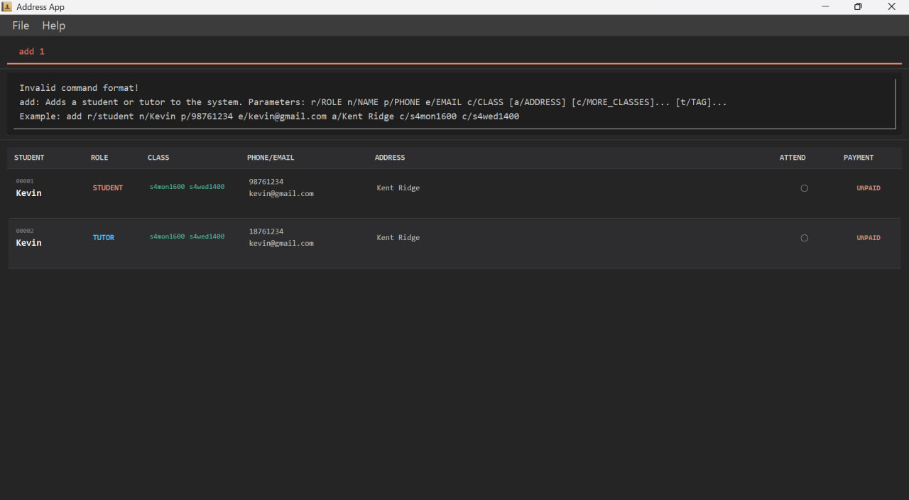
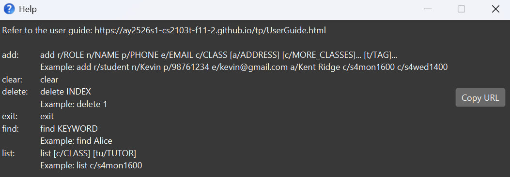
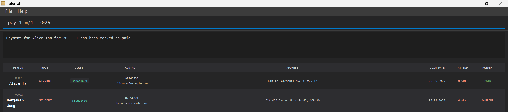
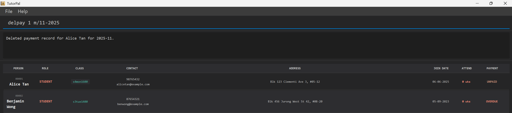

# TutorPal User Guide

TutorPal helps small, single-subject tuition centre owners manage students and tutors effortlessly by centralizing contact info, attendance and monthly payment tracking (student fees and tutor salaries) in one easy-to-use command-line system. Designed for owners, tutors, and admins who are familiar with CLI workflows, it saves time, reduces errors, and lets you focus on teaching instead of paperwork.

<!-- * Table of Contents -->
<page-nav-print />

## Table of contents
- [Quick start](#quick-start)
- [Features](#features)
- [FAQ](#faq)
- [Known issues](#known-issues)
- [Command summary](#command-summary)

## Quick start

1. Ensure you have Java `17` or above installed in your Computer. 
   **Mac users:** Ensure you have the precise JDK version prescribed [here](https://se-education.org/guides/tutorials/javaInstallationMac.html).

2. Download the latest `.jar` file from [here](https://github.com/AY2526S1-CS2103T-F11-2/tp/releases).

1. Copy the file to the folder you want to use as the _home folder_ for your TutorPal.

4. Open a command terminal, `cd` into the folder you put the jar file in, and use the `java -jar tutorpal.jar` command to run the application. 
   A GUI similar to the below should appear in a few seconds. Note how the app contains some sample data. 
   

5. Type the command in the command box and press Enter to execute it. e.g. typing **`help`** and pressing Enter will open the help window. 
   Some example commands you can try: 
   `add r/student n/Kevin p/98761234 e/kevin@gmail.com a/Kent Ridge c/s4mon1600 d/06-10-2025` 
   `add r/tutor n/Calvin p/99998888 e/calvin@gmail.com c/s4mon1600 d/29-10-2025 c/s1mon1800` 
   `pay 1 m/10-2025` 
   `mark 1 w/W44-2025` 
   `delete 2` 
   `find Kevin` 
   `list c/s4mon1600`

1. Refer to the [Features](#features) below for details of each command.

## Features

<box type="info" seamless>

**Notes about the command format:** 

* Words in `UPPER_CASE` are the parameters to be supplied by the user. 
  e.g. in `add n/NAME`, `NAME` is a parameter which can be used as `add n/John Doe`.

* Items in square brackets are optional. 
  e.g `n/NAME [a/ADDRESS]` can be used as `n/John Doe a/Kent Ridge` or as `n/John Doe`.

* Items with `…`​ after them can be used multiple times including zero times. 
  e.g. `[c/MORE_CLASSES]…​` can be used as ` ` (i.e. 0 times), `c/s4mon1600`, `c/s4mon1600 c/s4mon1400` etc.

* Parameters can be in any order. 
  e.g. if the command specifies `n/NAME p/PHONE_NUMBER`, `p/PHONE_NUMBER n/NAME` is also acceptable.

* Extraneous parameters for commands that do not take any parameters (such as `exit` and `clear`) will be ignored. 
  e.g. if the command specifies `exit 123`, it will be interpreted as `exit`.

* If you are using a PDF version of this document, be careful when copying and pasting commands that span multiple lines as space characters surrounding line-breaks may be omitted when copied over to the application.
</box>

### Viewing help : `help`

Shows a message explaining how to access the [help page](https://ay2526s1-cs2103t-f11-2.github.io/tp/UserGuide.html), as well as a quick summary of all commands and how to use them.
When used with a command, it displays a detailed description of how the command should be used. 

<box type="warning" seamless>
`help` is not a valid `COMMAND_WORD` i.e. `help help` is not valid.
</box>

Format:
`help [COMMAND_WORD]`

Examples:
- help add
- help delete

### Adding a person: `add`

Adds a student or tutor to the system.

Format:
`add r/ROLE n/NAME p/PHONE e/EMAIL c/CLASS [a/ADDRESS] [d/JOINDATE] [c/MORE_CLASSES]...`

Examples:
- `add r/student n/Kevin p/98761234 e/kevin@gmail.com a/Kent Ridge c/s4mon1600 d/06-10-2025`
- `add r/tutor n/Calvin p/99998888 e/calvin@gmail.com c/s4mon1600 d/29-10-2025 c/s1mon1800`

What to know:
- `ROLE` must be `student` or `tutor`.
- `NAME` must only contain alphanumeric characters and space, with no consecutive spaces.
- Leading and trailing spaces are ignored for `NAME`.
- `ADDRESS` can contain any characters (except leading spaces); multiple spaces are allowed.
- At least one class is required (`c/`). Class format: `s[level][day][time]`, e.g., `s4mon1600`.
- `PHONE` must be exactly 8 digits and start with 6, 8, or 9.
- Address (`a/`) is optional.
- Join date (`d/`) is optional; defaults to today. Format: `dd-MM-yyyy`. Year must be from 2000 onwards.

Corner cases:
- Students can have exactly one class; tutors can have one or more classes (repeat `c/`).
- Repeating the same non-repeatable field (`r/`, `n/`, `p/`, `e/`, `a/`, `d/`) is not allowed and shows a “repeated field” error.
- If any value is invalid (e.g., phone, email, class), the command fails with a clear message.

<box type="tip" seamless>
Legal names are not required in the context of tuition centre owners keeping track of student and tutor names, hence names with only alphanumeric characters are sufficient.
</box>

<box type="tip" seamless>
Two persons are considered the same if they have the same name and phone number. Name is case-insensitive.
</box>

<box type="tip" seamless>
Tip: For tutors, add more classes by repeating c/, e.g., c/s4mon1600 c/s4wed1400.
</box>

<box type="tip" seamless>

To maintain high data quality and ensure consistent reporting, **joinDate** must be between 01-01-2000 and
**your computer's local system date and time**.   
This range reflects realistic onboarding windows for current operations and prevents entry of implausible historical dates.
</box>

### Listing all persons : `list`

Shows a list of students and tutors, optionally filtered by criteria.

Formats:
* `list`
* `list c/CLASS`
* `list t/TUTOR`
* `list ps/STATUS`

What to know:
* `list` shows **all contacts** (students and tutors)
* `list c/...` shows **students/tutors** whose class code matches the given code or prefix
    * Accepts same class format as add: s[1-5][day][time] (e.g. s4mon1600)
    * Prefix matching is allowed:
        * s4 - all Secondary 4 classes (any day/time)
        * s4mon - all Secondary 4 Monday classes (any time)
    * If you provide only part of the class, it acts as a wildcard for the remaining parts
* `list t/...` shows **students** enrolled in any class taught by tutors whose name contains the given keyword
    * The keyword can be **any continuous part** of the name (in order), and matching is case-insensitive
    * If multiple tutors match, students from **all** those tutors' classes are listed (duplicates removed)
* `list ps/...` shows **students/tutors** by monthly payment status (tuition fees for students, salary for tutors)
    * Allowed values (case-insensitive): `paid`, `unpaid`, `overdue`
    * Paid — every month from Join Month up to and including the current month is paid
    * Unpaid — all months before the current month are paid, but the current month is not yet paid
    * Overdue — there exists any unpaid month before the current month
* Combining Filters
    * Filters of the same type are **OR-ed**: e.g. `list c/s4 c/s2` returns students in class s4 or s2.
    * Filters of different types are **AND-ed**: e.g. `list c/s4 ps/unpaid` returns students in s4 and with unpaid fees.
    * Used together: e.g. `list c/s4 c/s2 ps/unpaid` returns students in s4 or s2 and with unpaid fees (duplicates removed).

Examples:
* `list` - shows all persons
* `list c/s4` - shows **all Sec 4 students** across day/time
* `list c/s4mon1600` - shows **Sec 4 Monday 1600** students only
* `list t/Alex` - **students** taught by any tutor whose name contains `Alex`
* `list ps/paid` - shows persons whose payment status is **Paid**

### Displaying a person: `display`

Displays detailed information about a person in TutorPal.

Format:
`display INDEX`

* Displays the person at the specified `INDEX`.
* The index refers to the index number shown in the displayed person list.
* The index **must be a positive integer** 1, 2, 3, …​

Examples:
- `display 3`

### Editing a person : `edit`

Edits an existing person in TutorPal.

Format:
`edit INDEX [n/NAME] [p/PHONE] [e/EMAIL] [a/ADDRESS] [d/JOINDATE] [c/CLASS]…`

Examples:
- `edit 1 p/91234567 e/johndoe@example.com`
- `edit 2 c/s4mon1600 c/s4wed1400` (For a tutor)
- `edit 3 d/15-02-2024`

What to know:
- INDEX refers to the number shown in the list (1-based).
- At least one field must be provided.
- Role (`r/`) cannot be edited.
- Editing classes replaces all existing classes (not added on top).
- Join date (`d/`) must be from year 2000 onwards.

Corner cases:
- Students must end up with exactly one class. If you provide more than one class for a student, the edit fails.
- Providing an empty class (`c/` with no value) is not allowed; at least one class is required.
- Changing join date (`d/`) is allowed, but any already-marked attendance must still be valid with the new join date:
  - Attendance is valid only from the student’s join week up to the current week (inclusive).
  - If the new join date would make some marked weeks invalid, the edit will fail. Unmark those weeks first, then edit the join date.
  - This avoids unexpected hidden changes while ensuring all attendance are valid.
- If INDEX is not in the displayed list, the command fails with an “invalid index” message.

### Locating students and tutors by name: `find`

Finds students and tutors whose names contain any of the given keywords.

Format:
`find KEYWORD [MORE_KEYWORDS]`

* The search is case-insensitive. e.g `chong` will match `Chong`
* The order of the keywords does not matter. e.g. `Chong Rui` will match `Rui Chong`
* Only the name is searched.
* Only full words are matched; e.g., `Shen` will not match `Sheng`.
* Persons matching at least one keyword will be returned (i.e. `OR` search).

Examples:
* `find Sheng` returns `Sheng` and `Yong Sheng`
* `find Lee Sen More` returns `Lee Ze Xuan`, `Sen Yong Sheng` and `More Robin`

### Marking attendance for students : `mark`

Marks the selected student as having attended a specific ISO week.

Format:
`mark INDEX w/ATTENDANCEWEEK`

Example:
- `mark 3 w/W10-2024`

What to know:
- Only students can be marked; marking tutors shows an error.
- Attendance weeks are in `WXX-yyyy` format (ISO-8601), same as `unmark`.
    - Where `W` is case-insensitive,
    - `XX` represents the ISO week, the student attended,
    - and `yyyy` represents the corresponding year. Supported years are year 2000 and onwards.
- We are using weeks defined according to ISO-8601, which is an international standard.
    - This is also a common standard used in the education industry.
    - To find out more, please visit [this page](https://www.iso.org/iso-8601-date-and-time-format.html).
- To view marked attendances, please use the `display` command.

Corner cases:
- You can only mark weeks from the student’s join week up to the current week inclusive.
- Marking the same week again fails with an error.
- Week 53 is only valid in years that actually have 53 weeks.

### Unmarking attendance for students : `unmark`

Unmarks the selected student as having attended a specific ISO week.

Format:
`unmark INDEX w/ATTENDANCEWEEK`

Example:
- `unmark 3 w/W10-2024`

What to know:
- Only students can be unmarked; attempting to unmark a tutor shows an error.
- Attendance weeks are in `WXX-yyyy` format (ISO-8601), same as `mark`.
    - `W` is case-insensitive,
    - `XX` is the ISO week the student was previously marked for,
    - and `yyyy` is the corresponding year (2000 and onwards supported).
- We are using weeks defined according to ISO-8601, which is an international standard.
    - This is also a common standard used in the education industry.
    - To find out more, please visit [this page](https://www.iso.org/iso-8601-date-and-time-format.html).
- To view marked attendances before unmarking, use the `display` command.

Corner cases:
- You can only unmark weeks from the student’s join week up to the current week inclusive.
- Unmarking a week that was never marked fails with an error.
- Week 53 is only valid in years that actually have ISO week 53.

### Managing payments : `pay`

Records monthly fee payments and show each person's payment status

Format: `pay INDEX m/MM-yyyy`

Details:
* Marks the specified month and year as paid for the person at `INDEX`
* Each person has a **Join Month** in MM-yyyy. Billing starts from this month inclusive
* Month format must be MM-yyyy (e.g., 04-2025)
* By default, paying for months **after the current month** and **before Join Month** are not allowed
* Only one m/ is allowed, providing m/ more than once is rejected.
* Paid - every month from **Join Month** up to **and including** the current month is paid
* Unpaid - all months **before** the current month are paid, but the **current month** is not yet paid
* Overdue - there exists **any unpaid month** before the current month

Examples (assume today is Oct 2025):
* `pay 3 m/09-2025` - marks Sept 2025 as paid for person #3

<box type="tip" seamless>

TutorPal uses your computer’s **local system date and time** to determine the current month.
This means payment validation (e.g., blocking future months) follows your device’s clock and timezone.
If your system date/time is incorrect or set to a different timezone, payment restrictions may not behave as expected.
Ensure your computer’s date and time are accurate for consistent results.

</box>

<box type="tip" seamless>

`pay` has different meanings for tutors and students. `pay` on tutor means paying the tutor whereas `pay` on student means collecting payment from the student.

</box>

### Managing payments : `unpay`

Reverts monthly fee payments and show each person's payment status

Format: `unpay INDEX m/MM-yyyy`

Details:
* Marks the specified month and year as unpaid for the person at `INDEX`
* Month format must be MM-yyyy (e.g., 04-2025)
* By default, unpaying months **after the current month** and **before Join Month** are not allowed
* Only one `m/` is allowed, providing `m/` more than once is rejected.

Examples (assume today is Oct 2025):
* `unpay 3 m/09-2025` - marks Sept 2025 as unpaid for person #3

<box type="tip" seamless>

TutorPal uses your computer’s **local system date and time** to determine the current month.
This means payment validation (e.g., blocking future months) follows your device’s clock and timezone.
If your system date/time is incorrect or set to a different timezone, payment restrictions may not behave as expected.
Ensure your computer’s date and time are accurate for consistent results.

</box>

<box type="tip" seamless>

`unpay` has different meanings for tutors and students. `unpay` on a tutor means reversing a salary payment made to the tutor, whereas unpay on a student means reverting a fee payment received from the student.

</box>

### Deleting a payment record: `delpay`

Removes the stored payment record for a specific month.

Format: `delpay INDEX m/MM-yyyy`

Details:
* Deletes the record for the specified month and year for the person at `INDEX`
* Month format must be MM-yyyy (e.g., 04-2025)
* You can only delete months from the Join Month up to the current month
* After deletion, the month is treated as unpaid for display and status

Example:
* `delpay 2 m/08-2025`

### Deleting a person : `delete`

Deletes the specified person from TutorPal.

Format: `delete INDEX`

* Deletes the person at the specified `INDEX`.
* The index refers to the index number shown in the displayed person list.
* The index **must be a positive integer** 1, 2, 3, …​

Examples:
* `list` followed by `delete 2` deletes the 2nd person in TutorPal.
* `find Betsy` followed by `delete 1` deletes the 1st person in the results of the `find` command.

### Clearing all entries : `clear`

Clears all entries from TutorPal.

Format: `clear`

### Exiting the program : `exit`

Exits the program.

Format: `exit`

### Saving the data

TutorPal data are saved in the hard disk automatically after any command that changes the data. There is no need to save manually.

### Editing the data file

TutorPal data are saved automatically as a JSON file `[JAR file location]/data/addressbook.json`. Advanced users are welcome to update data directly by editing that data file.

<box type="warning" seamless>

**Caution:**
If your changes to the data file makes its format invalid, TutorPal will discard all data and start with an empty data file at the next run.  Hence, it is recommended to take a backup of the file before editing it. 
Furthermore, certain edits can cause the TutorPal to behave in unexpected ways (e.g., if a value entered is outside the acceptable range). Therefore, edit the data file only if you are confident that you can update it correctly.
</box>

### Keeping data consistent when editing manually

When manually editing the JSON data file, ensure that all **join-date values** across different parts of each person’s record are kept in sync.

<box type="warning" seamless>

**Important:**

TutorPal stores the join date in three separate places:

1. In the main person object (`joinDate`) — uses the format **DD-MM-YYYY**
2. In the payment history — uses the format **YYYY-MM-DD**
3. In the attendance history’s `joinDate` — uses the format **DD-MM-YYYY**

All three must refer to the **same date**.
If they are not consistent, TutorPal may display incorrect payment or attendance information.
</box>

<box type="tip" seamless>

Before saving, double-check that:
- The `joinDate` in the main person record matches the one in the attendance/payment history.
- The payment history uses the correct format (**YYYY-MM-DD**).
- You have created a backup copy of the data file before making changes.
</box>

--------------------------------------------------------------------------------------------------------------------

## FAQ

**Q**: How do I transfer my data to another Computer? 
**A**: Install the app in the other computer and overwrite the empty data file it creates with the file that contains the data of your previous TutorPal home folder.

**Q**: Can I back up my data? 
**A**: Yes. Simply copy the data folder (containing addressbook.json) to another location.

--------------------------------------------------------------------------------------------------------------------

## Known issues

1. **When using multiple screens**, if you move the application to a secondary screen, and later switch to using only the primary screen, the GUI will open off-screen. The remedy is to delete the `preferences.json` file created by the application before running the application again.
2. **If you minimize the Help Window** and then run the `help` command (or use the `Help` menu, or the keyboard shortcut `F1`) again, the original Help Window will remain minimized, and no new Help Window will appear. The remedy is to manually restore the minimized Help Window.

--------------------------------------------------------------------------------------------------------------------

## Command summary

Action     | Format, Examples
-----------|----------------------------------------------------------------------------------------------------------------------------------------------------------------------
**Add**    | `add r/ROLE n/NAME p/PHONE e/EMAIL c/CLASS [a/ADDRESS] [d/JOINDATE] [c/MORE_CLASSES]...`   e.g., `add r/student n/Kevin p/98761234 e/kevin@gmail.com a/Kent Ridge c/s4mon1600 d/06-10-2025`
**Clear**  | `clear`
**Delete** | `delete INDEX`  e.g., `delete 3`
**Display** | `display INDEX`  e.g., `display 4`
**Edit**   | `edit INDEX [n/NAME] [p/PHONE] [e/EMAIL] [a/ADDRESS] [d/JOINDATE] [c/CLASS]…`  e.g., `edit 2 n/James Lee e/jameslee@example.com`
**Exit**   | `exit`
**Find**   | `find KEYWORD [MORE_KEYWORDS]`  e.g., `find James Jake`
**List**   | `list [c/CLASS] [t/TUTOR] [ps/STATUS]`
**Mark**   | `mark INDEX w/ATTENDANCEWEEK`  e.g., `mark 3 w/W10-2024`
**Unmark** | `unmark INDEX w/ATTENDANCEWEEK`  e.g., `unmark 3 w/W10-2024`
**Pay**    | `pay INDEX m/MM-yyyy`
**Unpay**  | `unpay INDEX m/MM-yyyy`
**Delpay** | `delpay INDEX m/MM-yyyy`
**Help**   | `help`
