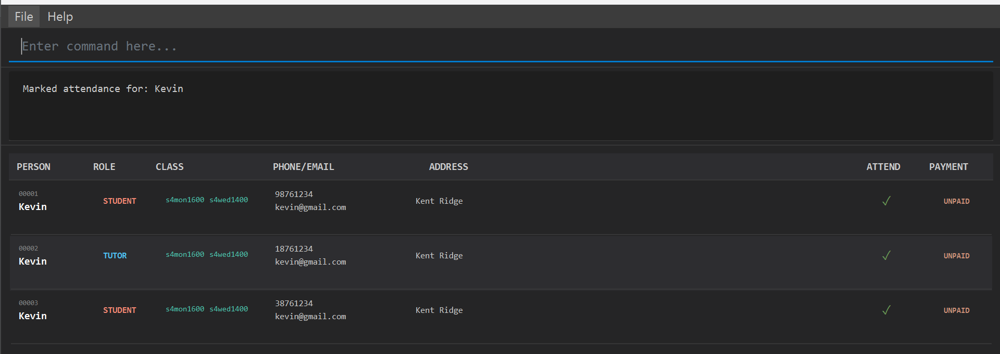

# TutorPal User Guide

TutorPal helps small, single-subject tuition centres manage students effortlessly by centralising contact details, grades, attendance, payment status, subject assignments, tutors, and class schedules in one easy-to-use command-line system (with a simple GUI). Designed for owners, tutors, and admins who are familiar with CLI workflows, it saves time, reduces errors, and lets you focus on teaching instead of paperwork.

<!-- * Table of Contents -->
<page-nav-print />

--------------------------------------------------------------------------------------------------------------------

## Quick start

1. Ensure you have Java `17` or above installed in your Computer. 
   **Mac users:** Ensure you have the precise JDK version prescribed [here](https://se-education.org/guides/tutorials/javaInstallationMac.html).

1. Download the latest `.jar` file from [here](https://github.com/AY2526S1-CS2103T-F11-2/tp/releases).

1. Copy the file to the folder you want to use as the _home folder_ for your TutorPal.

1. Open a command terminal, `cd` into the folder you put the jar file in, and use the `java -jar tutorpal.jar` command to run the application. 
   A GUI similar to the below should appear in a few seconds. Note how the app contains some sample data. 
   

1. Type the command in the command box and press Enter to execute it. e.g. typing **`help`** and pressing Enter will open the help window. 
   Some example commands you can try:
   `add r/student n/Kevin p/98761234 e/kevin@gmail.com a/Kent Ridge c/s4mon1600 d/06-10-2025`
   `add r/tutor n/Calvin p/99998888 e/calvin@gmail.com c/s4mon1600 d/29-10-2025 c/s1mon1800`
   `pay 1 m/10-2025`
   `mark 1 w/W44-2025`
   `delete 2`
   `find Kevin`
   `list c/s4mon1600`

1. Refer to the [Features](#features) below for details of each command.

--------------------------------------------------------------------------------------------------------------------

## Features

<box type="info" seamless>

**Notes about the command format:** 

* Words in `UPPER_CASE` are the parameters to be supplied by the user. 
  e.g. in `add n/NAME`, `NAME` is a parameter which can be used as `add n/John Doe`.

* Items in square brackets are optional. 
  e.g `n/NAME [a/ADDRESS]` can be used as `n/John Doe a/Kent Ridge` or as `n/John Doe`.

* Items with `…`​ after them can be used multiple times including zero times. 
  e.g. `[c/MORE_CLASSES]…​` can be used as ` ` (i.e. 0 times), `c/s4mon1600`, `c/s4mon1600 c/s4mon1400` etc.

* Parameters can be in any order. 
  e.g. if the command specifies `n/NAME p/PHONE_NUMBER`, `p/PHONE_NUMBER n/NAME` is also acceptable.

* Extraneous parameters for commands that do not take in parameters (such as `exit` and `clear`) will be ignored. 
  e.g. if the command specifies `exit 123`, it will be interpreted as `exit`.

* If you are using a PDF version of this document, be careful when copying and pasting commands that span multiple lines as space characters surrounding line-breaks may be omitted when copied over to the application.
</box>

### Viewing help : `help`

Shows a message explaining how to access the [help page](https://ay2526s1-cs2103t-f11-2.github.io/tp/UserGuide.html), as well as a quick summary of all commands and how to use them. 
When used with a command, it displays a detailed description of how the command should be used.

Format: 
`help [COMMAND_WORD]`

Examples:
- help add
- help delete

### Adding a person: `add`

Adds a student or tutor to the system.

Format:
`add r/ROLE n/NAME p/PHONE e/EMAIL c/CLASS [a/ADDRESS] [d/JOINDATE] [c/MORE_CLASSES]...`

Examples:
- add r/student n/Kevin p/98761234 e/kevin@gmail.com a/Kent Ridge c/s4mon1600 d/06-10-2025
- add r/tutor n/Calvin p/99998888 e/calvin@gmail.com c/s4mon1600 d/29-10-2025 c/s1mon1800

What to know:
- ROLE must be student or tutor.
- At least one class is required (c/). Class format: s[level][day][time], e.g., s4mon1600.
- Address (a/) is optional.
- Join date (d/) is optional; defaults to today. Format: dd-MM-yyyy.

Corner cases:
- Students can have exactly one class; tutors can have one or more classes (repeat c/).
- Repeating the same non-repeatable field (r/, n/, p/, e/, a/, d/) is not allowed and shows a “repeated field” error.
- If any value is invalid (e.g., phone, email, class), the command fails with a clear message.

<box type="tip" seamless>
Tip: For tutors, add more classes by repeating c/, e.g., c/s4mon1600 c/s4wed1400.
</box>

### Listing all persons : `list`

Shows a list of students and tutors, optionally filtered by criterias.

Formats:
* `list`
* `list c/CLASS`
* `list t/TUTOR`
* `list ps/STATUS`

What to know:
* `list` shows **all contacts** (students and tutors)
* `list c/...` shows **students/tutors** whose class code matches the given code or prefix
    * Accepts same class format as add: s[1-5][day][time] (e.g. s4mon1600)
    * Prefix matching is allowed:
        * s4 - all Secondary 4 classes (any day/time)
        * s4mon - all Secondary 4 Monday classes (any time)
    * If you provide only part of the class, it acts as a wildcard for the remaining parts
* `list tu/...` shows **students** enrolled in any class taught by tutors whose name contains the given keyword
    * The keyword can be **any continuous part** of the name (in order), and matching is case-insensitive
    * If multiple tutors match, students from **all** those tutors' classes are listed (duplicates removed)
* `list ps/...` shows **students/tutors** by monthly payment status (tuition fees for students, salary for tutors)
    * Allowed values (case-insensitive): `paid`, `unpaid`, `overdue`
    * Paid — every month from Join Month up to and including the current month is paid
    * Unpaid — all months before the current month are paid, but the current month is not yet paid
    * Overdue — there exists any unpaid month before the current month
* Combining Filters
    * Filters of the same type are **OR-ed**: e.g. `list c/s4 c/s2` returns students in class s4 or s2.
    * Filters of different types are **AND-ed**: e.g. `list c/s4 ps/unpaid` returns students in s4 and with unpaid fees.
    * Used together: e.g. `list c/s4 c/s2 ps/unpaid` returns students in s4 or s2 and with unpaid fees (duplicates removed).

Examples:
* `list` - shows all persons
* `list c/s4` - shows **all Sec 4 students** across day/time
* `list c/s4mon1600` - shows **Sec 4 Monday 1600** students only
* `list t/Alex` - **students** taught by any tutor whose name contains `Alex`
* `list ps/paid` - shows persons whose payment status is **Paid**

### Editing a person : `edit`

Edits an existing person in TutorPal.

Format:
`edit INDEX [n/NAME] [p/PHONE] [e/EMAIL] [a/ADDRESS] [j/JOINDATE] [c/CLASS]…`

Examples:
- edit 1 p/91234567 e/johndoe@example.com
- edit 2 c/s4wed1400
- edit 3 j/15-02-2024

What to know:
- INDEX refers to the number shown in the list (1-based).
- At least one field must be provided.
- Role (r/) cannot be edited.
- Editing classes replaces all existing classes (not added on top).

Corner cases:
- Students must end up with exactly one class. If you provide more than one class for a student, the edit fails.
- Providing an empty class (c/ with no value) is not allowed; at least one class is required.
- Changing join date (j/) is allowed, but any already-marked attendance must still be valid with the new join date:
  - Attendance is only valid from the join week up to the current week (inclusive).
  - If the new join date would make some marked weeks invalid, the edit will fail. Unmark those weeks first, then edit the join date. This avoids hidden changes and keeps attendance clean.
- If INDEX is not in the displayed list, the command fails with an “invalid index” message.

### Locating students and tutors by name: `find`

Finds students and tutors whose names contain any of the given keywords.

Format: 
`find KEYWORD [MORE_KEYWORDS]`

* The search is case-insensitive. e.g `chong` will match `Chong`
* The order of the keywords does not matter. e.g. `Chong Rui` will match `Rui Chong`
* Only the name is searched.
* Only full words will be matched e.g. `Shen` will not match `Sheng`
* Persons matching at least one keyword will be returned (i.e. `OR` search).

Examples:
* `find Sheng` returns `Sheng` and `Yong Sheng`
* `find Lee Sen More` returns `Lee Ze Xuan`, `Sen Yong Sheng` and `More Robin`
  
### Marking attendance for students : `mark`

Marks the selected student as having attended a specific ISO week.

Format:
`mark INDEX w/[ATTENDANCEWEEK]`

Example:
- mark 3 w/W10-2024

What to know:
- Only students can be marked; marking tutors shows an error.
- Attendance weeks are in W[XX]-YYYY format. Where XX represents the ISO week, the student attended, and YYYY represents the corresponding year. The format is case-insensitive.
- ISO-8601 weeks:
  - Weeks start Monday; Week 1 is the week containing Jan 4.
  - Some years have 53 weeks.
  - The week “year” (YYYY) can differ from the calendar year near year-end.
  - Valid years are 0001–9999.

Corner cases:
- You can only mark weeks from the student’s join week up to the current week (inclusive).
- Marking the same week again fails with “already marked”.
- Week 53 is only valid in years that actually have 53 weeks.

### Unmarking attendance for students : `unmark`

Removes attendance for a specific ISO week.

Format:
`unmark INDEX w/[ATTENDANCEWEEK]`

Example:
- unmark 3 w/W10-2024

What to know:
- Only students can be unmarked.
- Uses the same ISO week format as mark.

Corner cases:
- You can only unmark weeks within the valid range (join week to current week, inclusive).
- Unmarking a week that was never marked fails with “not marked yet”.

### Managing payments : `pay`

Records monthly fee payments and show each person's payment status

Format: `pay INDEX [m/MM-YYYY]`

Details:
* Marks the specified month and year as paid for the person at `INDEX`
* Each person has a **Join Month** in MMMM-YYYY. Billing starts from this month inclusive
* Month format must be MM-YYYY (e.g., 04-2025)
* By default, paying for months **after the current month** and **before Join Month** are not allowed
* Paid - every month from **Join Month** up to **and including** the current month is paid
* Unpaid - all months **before** the current month are paid, but the **current month** is not yet paid
* Overdue - there exists **any unpaid month** before the current month 

Examples (assume today is Oct 2025):
* `pay 3 m/09-2025` - marks Sept 2025 as paid for person #3

--------------------------------------------------------------------------------------------------------------------

## Deleting a person : `delete`

Deletes the specified person from TutorPal.

Format: `delete INDEX`

* Deletes the person at the specified `INDEX`.
* The index refers to the index number shown in the displayed person list.
* The index **must be a positive integer** 1, 2, 3, …​

Examples:
* `list` followed by `delete 2` deletes the 2nd person in TutorPal.
* `find Betsy` followed by `delete 1` deletes the 1st person in the results of the `find` command.

### Clearing all entries : `clear`

Clears all entries from TutorPal.

Format: `clear`

### Exiting the program : `exit`

Exits the program.

Format: `exit`

### Saving the data

TutorPal data are saved in the hard disk automatically after any command that changes the data. There is no need to save manually.

### Editing the data file

TutorPal data are saved automatically as a JSON file `[JAR file location]/data/addressbook.json`. Advanced users are welcome to update data directly by editing that data file.

<box type="warning" seamless>

**Caution:**
If your changes to the data file makes its format invalid, TutorPal will discard all data and start with an empty data file at the next run.  Hence, it is recommended to take a backup of the file before editing it. 
Furthermore, certain edits can cause the TutorPal to behave in unexpected ways (e.g., if a value entered is outside the acceptable range). Therefore, edit the data file only if you are confident that you can update it correctly.
</box>

--------------------------------------------------------------------------------------------------------------------

## FAQ

**Q**: How do I transfer my data to another Computer? 
**A**: Install the app in the other computer and overwrite the empty data file it creates with the file that contains the data of your previous TutorPal home folder.

--------------------------------------------------------------------------------------------------------------------

## Known issues

1. **When using multiple screens**, if you move the application to a secondary screen, and later switch to using only the primary screen, the GUI will open off-screen. The remedy is to delete the `preferences.json` file created by the application before running the application again.
2. **If you minimize the Help Window** and then run the `help` command (or use the `Help` menu, or the keyboard shortcut `F1`) again, the original Help Window will remain minimized, and no new Help Window will appear. The remedy is to manually restore the minimized Help Window.

--------------------------------------------------------------------------------------------------------------------

## Command summary

Action     | Format, Examples
-----------|----------------------------------------------------------------------------------------------------------------------------------------------------------------------
**Add**    | `add r/ROLE n/NAME p/PHONE e/EMAIL c/CLASS [a/ADDRESS] [j/JOINDATE] [c/MORE_CLASSES]...`   e.g., `add r/student n/Kevin p/98761234 e/kevin@gmail.com a/Kent Ridge c/s4mon1600 j/06-10-2025`
**Clear**  | `clear`
**Delete** | `delete INDEX`  e.g., `delete 3`
**Edit**   | `edit INDEX [n/NAME] [p/PHONE] [e/EMAIL] [a/ADDRESS] [j/JOINDATE] [c/CLASS]…`  e.g.,`edit 2 n/James Lee e/jameslee@example.com`
**Exit**   | `exit`
**Find**   | `find KEYWORD [MORE_KEYWORDS]`  e.g., `find James Jake`
**List**   | `list [c/CLASS] [t/TUTOR]`
**Mark**   | `mark INDEX w/[ATTENDANCEWEEK]`  e.g., `mark 3 w/W10-2024`
**Unmark** | `unmark INDEX w/[ATTENDANCEWEEK]`  e.g., `unmark 3 w/W10-2024`
**Help**   | `help [COMMAND_WORD]`
